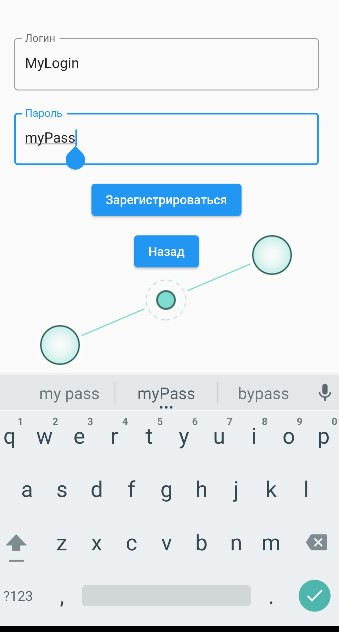
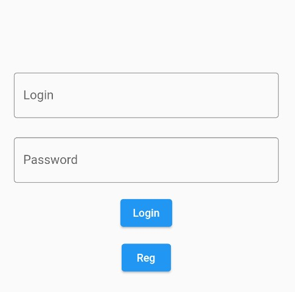
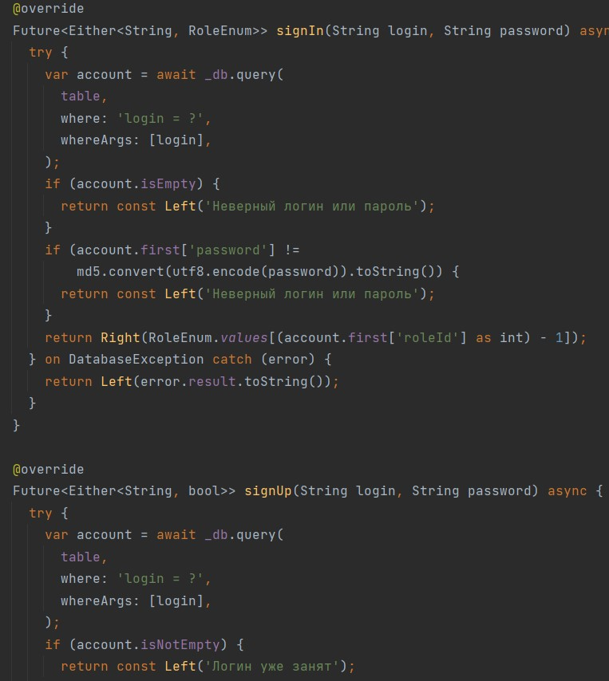
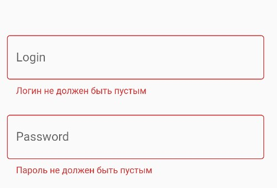

# Практическая работа номер 3
## Тема: реализация регистрации и авторизации.

#### Цель работы: реализовать регистрацию и авторизацию пользователя. Провалидировать каждое поле. Реализовать переход при успешной авторизации. Реализовать вывод сообщения при неудачной авторизации или регистрации. Сделать хэширование пароля.

#### Ход работы:

Авторизация/регистрация

Окно авторизации

Валидация полей

Пустое поле

Окно регистрации с ошибками

#### Вывод: реализовал регистрацию и авторизацию пользователя. Провалидировал каждое поле. Реализовал переход при успешной авторизации. Реализовал вывод сообщения при неудачной авторизации или регистрации.
